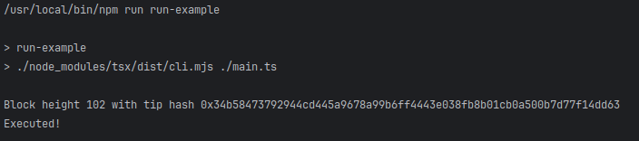

To run the example use the following command in a cli with working directory in this folder:
```shell
npm install
npm run run-example
```

For connecting and accessing EVM smart contracts we will use the web3-commons library
from Unleashed Business github repositories.
To use it we have to require it as a dependency in our project by running the following command:
```shell
npm install @unleashed-business/ts-web3-commons --save
```
or by adding it manually to our package json as follows:
```json
{
  ...
  "dependencies": {
    "@unleashed-business/ts-web3-commons": "<version>",
    ...
  },
  ...
}
``` 

Once we have the dependency we can start by creating obtaining an instance of the smart contract toolkit.
Usually this is done through dependency injection but it can as well be created manually.
For the example we defined a function for building the toolkit.
```typescript
import {buildContractToolkit} from "./toolkit.js";

const contractToolkit = buildContractToolkit();
```
For the contents of the function check the "toolkit.ts" file. \
Once we have the toolkit initialized we can define our blockchain and smart contract connection parameters.
We need to initialize an object of type "BlockchainDefinition" manually or use the provided blockchains from the
library. To access the predefined blockchains we can use the "blockchainIndex" constant part of the web3 library.
For this example we will connect to DMC testnet which is part of the predefined blockchains:
```typescript
import {blockchainIndex} from "@unleashed-business/ts-web3-commons";

...

const blockchainDefinition = blockchainIndex.DMC_TESTCHAIN;
```
To connect to any EVM smart contract we need to provide the address of the contract on the target chain.
The address of the contract is assigned on deployment and can also be found in explorers. For this example
we will use the partial chain registry of Interchain on DMC testnet which has the address: 0x2d8606ccCD62dbF8B70AafE1BE21d4881b536Ea0
The contract can be seen in the explorer as well: \
https://testnet-dmc.mydefichain.com/address/0x2d8606ccCD62dbF8B70AafE1BE21d4881b536Ea0
We can define it as follows:
```typescript
const registryContractAddress = "0x2d8606ccCD62dbF8B70AafE1BE21d4881b536Ea0";
```
We are ready to create the object which will give us access to the smart contract. To do that we need to have
an ABI definition for the smart contract which is a json string with function definitions for the smart contract.
We use the ABI definition to serialize and deserialize the smart contract communication.
We work with two kind of abi definitions - functional abi and "normal" abi.
The "normal abi" is obtained when smart contract are compiled in solidity and commonty used for connection to 
deployed smart contracts. Because we are accessing an Interchain smart contract we can use the already available abi definitions
part of the ts-abi library for Interchain.
We can add that to our project using the following command:
```shell
npm install @crypto-factor-labs/interchain-ts-abi --save
```
or by adding it manually to our package json as follows:
```json
{
  ...
  "dependencies": {
    "@crypto-factor-labs/interchain-ts-abi": "<version>",
    ...
  },
  ...
}
``` 
Once we have the library we have access to the partial chain registry functional and "normal" abis:
```typescript
import {
    PartialChainRegistryAbi,
    PartialChainRegistryAbiFunctional
} from "@crypto-factor-labs/interchain-ts-abi";
```
The functional abi is a OpenDApps Cloud custom abi definition which allows the Web3Contract object to provide 
auto-complete methods for the smart contract views and executables. These functional abis are always found in CFR
abi libraries as well to allow usage with Web3Contract.
Once we have the required abi definition we can finally define our smart contract access object:
```typescript
import {
    PartialChainRegistryAbi,
    PartialChainRegistryAbiFunctional
} from "@crypto-factor-labs/interchain-ts-abi";
import {blockchainIndex, Web3Contract} from "@unleashed-business/ts-web3-commons";

...


const blockchainDefinition = blockchainIndex.DMC_TESTCHAIN;
const registryContractAddress = "0x2d8606ccCD62dbF8B70AafE1BE21d4881b536Ea0";

const smartContract = new Web3Contract<PartialChainRegistryAbiFunctional>(contractToolkit, PartialChainRegistryAbi);
const registryContractReadonly = smartContract.readOnlyInstance(blockchainDefinition, registryContractAddress);
```
Once we have our read-only instance of the partial chain registry we can start making queries.
First we can make a query to fetch the tip height number for the partial chain. \
We can use the readonly instance and wit hthe help of auto-complete we can select the "tipHeight" view call.
When we call views from smart contract read-only instances we are required to provide 3 parameters.
An anonymous object with arguments for the call and two additional optional parametes for batch requests. 
Batch requests are not explained in this example and we will not provide these parametes.
The "tipHeight" view method does not have input arguments, and we provide and empty object because of that as the 
only argument to the call.
```typescript
const height = await registryContractReadonly.tipHeight<NumericResult>({})
    .then(x => bn_wrap(x as NumericResult));
```
All view calls from read-only instances require a generic parameter for the return type. In our example we are making a 
query for a number result. Numbers are special in EVM smart contracts and because this call can return anything from
string, number or bigint we can provide the special type "NumericResult", which is a combination of the three.
Once we do that we still need to convert the result into a common object which we can us and because of that we wrap it
into a "BigNumber" using bn_wrap function found in our library.
As a result to the call we have a BigNumber instance holding our tip height. \

To finish of this example we will make another call to fetch the block hash of the block with number equal to the tip
height. To do that we can again use the registry read-only instance but this time from the auto-complete we will select the
"getBlochByNumber" view call. This call does need arguments, and we can use the auto-complete to understand what is required.
In the case of our example we need to provide a "number" parameter for the height of the block. We can provide the already 
fetched tipHeight, but because the arguments do nto work with BigNumber instances we can easily convert it to string with
"toFixed". "toFixed" is preferred because the rest of the "toString" methods convert the number into exponent form.
This time for the return type defin an anon type which contains a blockHash. This is because the smart contract returns
a custom struct which we do not have defined, but we can easially do that if we want, but for the example we will use an 
anon type.
```typescript
 const block = await registryContractReadonly.getBlochByNumber<{blockHash: string}>({
        number: height.toFixed()
    }) as {blockHash: string};
```

Once we have the block we can easily print the block has in the console:
