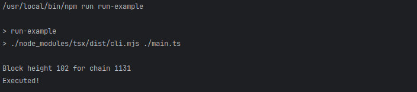

To run the example use the following command in a cli with working directory in this folder:
```shell
npm install
npm run run-example
```

For connecting and accessing EVM smart contracts we will use the web3-commons library
from Unleashed Business github repositories.
To use it we have to require it as a dependency in our project by running the following command:
```shell
npm install @unleashed-business/ts-web3-commons --save
```
or by adding it manually to our package json as follows:
```json
{
  ...
  "dependencies": {
    "@unleashed-business/ts-web3-commons": "<version>",
    ...
  },
  ...
}
``` 

Once we have the dependency we can start by creating obtaining an instance of the smart contract toolkit.
Usually this is done through dependency injection but it can as well be created manually.
For the example we defined a function for building the toolkit.
```typescript
import {buildContractToolkit} from "./toolkit.js";

const contractToolkit = buildContractToolkit();
```
For the contents of the function check the "toolkit.ts" file. \
Once we have the toolkit initialized we can define our blockchain and smart contract connection parameters.
We need to initialize an object of type "BlockchainDefinition" manually or use the provided blockchains from the
library. To access the predefined blockchains we can use the "blockchainIndex" constant part of the web3 library.
For this example we will connect to DMC testnet which is part of the predefined blockchains:
```typescript
import {blockchainIndex} from "@unleashed-business/ts-web3-commons";

...

const blockchainDefinition = blockchainIndex.DMC_TESTCHAIN;
```
To connect to any EVM smart contract we need to provide the address of the contract on the target chain.
The address of the contract is assigned on deployment and can also be found in explorers. For this example
we will use the partial chain registry of Interchain on DMC testnet which has the address: 0x2d8606ccCD62dbF8B70AafE1BE21d4881b536Ea0
The contract can be seen in the explorer as well: \
https://testnet-dmc.mydefichain.com/address/0x2d8606ccCD62dbF8B70AafE1BE21d4881b536Ea0
We can define it as follows:
```typescript
const registryContractAddress = "0x2d8606ccCD62dbF8B70AafE1BE21d4881b536Ea0";
```
We are ready to create the object which will give us access to the smart contract. To do that we need to have
an ABI definition for the smart contract which is a json string with function definitions for the smart contract.
We use the ABI definition to serialize and deserialize the smart contract communication.
We work with two kind of abi definitions - functional abi and "normal" abi.
The "normal abi" is obtained when smart contract are compiled in solidity and commonty used for connection to 
deployed smart contracts. Because we are accessing an Interchain smart contract we can use the already available abi definitions
part of the ts-abi library for Interchain.
We can add that to our project using the following command:
```shell
npm install @crypto-factor-labs/interchain-ts-abi --save
```
or by adding it manually to our package json as follows:
```json
{
  ...
  "dependencies": {
    "@crypto-factor-labs/interchain-ts-abi": "<version>",
    ...
  },
  ...
}
``` 
Once we have the library we have access to the partial chain registry functional and "normal" abis:
```typescript
import {
    PartialChainRegistryAbi,
    PartialChainRegistryAbiFunctional
} from "@crypto-factor-labs/interchain-ts-abi";
```
The functional abi is a OpenDApps Cloud custom abi definition which allows the Web3Contract object to provide 
auto-complete methods for the smart contract views and executables. These functional abis are always found in CFR
abi libraries as well to allow usage with Web3Contract.
Once we have the required abi definition we can finally define our smart contract access object:
```typescript
import {
    PartialChainRegistryAbi,
    PartialChainRegistryAbiFunctional
} from "@crypto-factor-labs/interchain-ts-abi";
import {blockchainIndex, Web3Contract} from "@unleashed-business/ts-web3-commons";

...


const blockchainDefinition = blockchainIndex.DMC_TESTCHAIN;
const registryContractAddress = "0x2d8606ccCD62dbF8B70AafE1BE21d4881b536Ea0";

const smartContract = new Web3Contract<PartialChainRegistryAbiFunctional>(contractToolkit, PartialChainRegistryAbi);
const registryContractReadonly = smartContract.readOnlyInstance(blockchainDefinition, registryContractAddress);
```
Once we have our read-only instance of the partial chain registry we can start making queries.
Making a lot of rpc calls in sequence is slow and does not scale well. This is why batch request exist in evm RPC servers
which allow for a group of calls to be executed in a single rpc call. WE can use such batch requests to group independent
calls to the smart contract to speed up load times and indexing times. 
To create a batch request we first need to create a connection to the target blockchain. We can do that using
the already existing toolkit and blockchain definition.
```typescript
const connection = contractToolkit.web3Connection.getWeb3ReadOnly(blockchainDefinition);
```
With the made connection we can now create a batch request object which will be the container for all of our calls 
which we want to execute in parallel.
```typescript
import {BatchRequest} from "@unleashed-business/ts-web3-commons/dist/contract/utils/batch-request.js";

...

const batch = new BatchRequest(connection);
```
With the batch request created we can start adding calls to it with the already known method calls of our
readonly instance. For this example we will fetch the chain id and tip height of the partial chain on DMC.
To add the calls to the batch we provide it as a second argument to methods calls and define callback function to be executed with
the result of the call once the batch is executed.
```typescript
await Promise.all([
    registryContractReadonly.tipHeight<NumericResult>({}, batch, x => results.height = bn_wrap(x as NumericResult)),
    registryContractReadonly.chainId<NumericResult>({}, batch, x => results.chainId = bn_wrap(x as NumericResult).toNumber()),
]);
```
All view calls from read-only instances require a generic parameter for the return type. In our example we are making a 
query for a number result. Numbers are special in EVM smart contracts and because this call can return anything from
string, number or bigint we can provide the special type "NumericResult", which is a combination of the three.
Once we do that we still need to convert the result into a common object which we can us and because of that we wrap it
into a "BigNumber" using bn_wrap function found in our library. \
When we add calls to the batch they are not executed, but still have to be awaited to actually be added to the batch.
Once add all of our calls to the batch we can execute it and obeserve the callbacks being executed and once the batch is
awaited, all data has been fetched and fed to the callbacks.
```typescript
await batch.execute({timeout: 20_000});
```
Once we have the results we can easily print the block has in the console:
