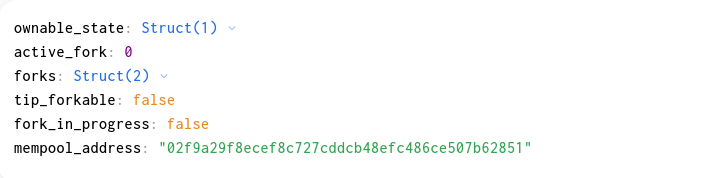
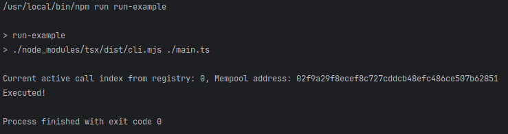

To run the example use the following command in a cli with working directory in this folder:
```shell
npm install
npm run run-example
```

For connecting and accessing Partisia Blockchain smart contract we will use the web3-commons library
from Unleashed Business github repositories.
To use it we have to require it as a dependency in our project by running the following command:
```shell
npm install @unleashed-business/ts-web3-commons --save
```
or by adding it manually to our package json as follows:
```json
{
  ...
  "dependencies": {
    "@unleashed-business/ts-web3-commons": "<version>",
    ...
  },
  ...
}
``` 

Once we have the dependency we can start by creating the PBC service for connecting and accessing smart contract
data. As in the example we have to create an instance of the class "PartisiaBlockchainService". In this
example we are only using the connection to read data from the chain and because of that we
can leave the argument for wallet connection as "undefined":
```typescript
import {PartisiaBlockchainService} from "@unleashed-business/ts-web3-commons/dist/pbc/pbc.service.js";
...

const partisiaConnection = new PartisiaBlockchainService(undefined);
```

Once we have an instance of our Partisia Blockchain connection service we can actually start
accessing the states of smart contracts using the "call" method. The method allows us to query
the state and avl trees of smart contracts on the Partisia Blockchain.
For this example we will be querying the Interchain Devnet Fork Registry, hosted on Partisia Testnet.
For this example the smart contract has the following state members: 

The state can be seen on the PBC Testnet explorer as well:
https://browser.testnet.partisiablockchain.com/contracts/021948b37c0c7942106aac95c0129c059f44016cb3?tab=state
We will make a query to select the active fork number as well as the active mempool address from the state 
using the "call" method as follows: 
```typescript
import {PBCChain} from "@unleashed-business/ts-web3-commons/dist/pbc/pbc.chains.js";
import {ForkRegistryAbi} from "@crypto-factor-labs/interchain-ts-abi";

...

const [activeMempoolAddress, activeForkIndex] = await partisiaConnection.call(
    PBCChain.TESTNET, [1]
    ForkRegistryAbi, [2]
    "021948b37c0c7942106aac95c0129c059f44016cb3", [3]
    state => {
        const activeForkIndex = state["active_fork"].asNumber(); [4]
        const activeMempool = state["mempool_address"].addressValue().value.toString("hex") [5]

        return [activeMempool, activeForkIndex];
    }
);
```
Alright, let us break down this code.
When we use the "call" method we provide a set of parameters that describe the query we want to make
to the Partisia Blockchain.
The first parameter [1] is an object of type "ChainDefinition" which is a predefined object used
to describe the rpc connection parameters of a Partisia blockchain instance like testnet and mainnet.
That object has the following structure:
```typescript
{
  // id of the blockchain used by CFR infra to describe PBC: 
  // 18500 - PBC testnet
  // 8500 - PBC mainnet  
  id: number; 
  // name of the PBC chain instance 
  name: string;
  // list of rpc urls to use for connect to the blockchain
  // Example (official testnet rpc): https://node1.testnet.partisiablockchain.com 
  rpcList: string[];
  // List of shards for the chain instance
  // Shard0, Shard1, etc 
  shards: string[];
}
```
When we want to make a call we need to provide an object of this time to be used for 
the rpc calls. In the web3-commons library there is a set of predefined PBC chain definitions
for testnet and mainnet which can be used directly. In this example we use the predefined
testnet connection object "PBCChain.TESTNET" as shown in [1].

Once we have provided the connection object we have to give the ABI definition of the target
smart contract as a second parameter [2]. This is a special definition generated while compiling
the smart contract using PBC toolkit for rust. The abi here is expected as a BASE64 encoded string
of the ABI definition. For contract already deployed on the partisia network we can download the
ABI definition through the explorer. For example, we can find the abi for the Fork Registry of Interchain
dev net here:
https://node1.testnet.partisiablockchain.com/chain/contracts/021948b37c0c7942106aac95c0129c059f44016cb3
For this example we will use the publicly available ABI definition package for Interchain.
We can add that to our project using the following command:
```shell
npm install @crypto-factor-labs/interchain-ts-abi --save
```
or by adding it manually to our package json as follows:
```json
{
  ...
  "dependencies": {
    "@crypto-factor-labs/interchain-ts-abi": "<version>",
    ...
  },
  ...
}
``` 
Once we have the ABI package we can see that there we have a definition for the fork registry
which we can use for our call here as shown in [2].
If we open up the ABI definition variable we can see it looks like this:
```typescript
export const ForkRegistryAbi = "UEJDQUJJCgIABQYAAAAADgEAAAAXSW50ZXJjaGFpblJlZ2lzdHJ5U3RhdGUAAAAGAAAADW93bmFibGVfc3RhdGUAAQAAAAthY3RpdmVfZm9yawMAAAAFZm9ya3MZAwACAAAADHRpcF9mb3JrYWJsZQwAAAAQZm9ya19pbl9wcm9ncmVzcwwAAAAPbWVtcG9vbF9hZGRyZXNzDQEAAAAMT3duYWJsZVN0YXRlAAAAAQAAAAVvd25lcg0BAAAAD01hc3RlckNoYWluRm9yawAAAAQAAAAPYWN0aXZhdGVfaGVpZ2h0BQAAABBkZXByZWNhdGVfaGVpZ2h0EgUAAAANY2hhaW5fYWRkcmVzcw0AAAAIY29kZW5hbWULAQAAABFQcm9wb3NlZEJsb2NrQm9keQAAAAIAAAAOcGFydGlhbF9jaGFpbnMOAwAAABV2YWxpZGF0ZWRfZXhlY3V0YWJsZXMOAAQBAAAAIVBiY0ludGVyY2hhaW5NZW1wb29sRXhlY3V0aW9uUGFydAAAAAQAAAAIY2hhaW5faWQDAAAADnNlbmRlcl9hZGRyZXNzAAUAAAAQb3BlcmF0b3JfYWRkcmVzcwAFAAAAE2V4ZWN1dGlvbl9zaWduYXR1cmUABgEAAAARUGJjQWRkcmVzc1dyYXBwZXIAAAABAAAABWlubmVyDQEAAAAPUGJjQnl0ZXNXcmFwcGVyAAAAAQAAAAVpbm5lcg4BAQAAABpFbXB0eUV4ZWN1dGlvbkNhbGxiYWNrRGF0YQAAAAABAAAADUJsb2NrSGFzaERhdGEAAAABAAAACmJsb2NrX2hhc2gACQEAAAAOUGJjSGFzaFdyYXBwZXIAAAABAAAABWlubmVyEwEAAAAPRm9ya0luZm9ybWF0aW9uAAAABAAAAAZoZWlnaHQFAAAAA3RpcAAJAAAAGXBhcnRpYWxfYmxvY2tfaW5mb3JtYXRpb24OAAsAAAASdW5jb25maXJtZWRfYmxvY2tzDgAMAQAAABtQYXJ0aWFsQ2hhaW5Gb3JrSW5mb3JtYXRpb24AAAADAAAACGNoYWluX3VkAwAAAAZoZWlnaHQFAAAAA3RpcAAJAQAAABBVbmNvbmZpcm1lZEJsb2NrAAAAAgAAAApibG9ja19oYXNoAAkAAAAJdGltZXN0YW1wBAEAAAAWRm9ya0luUHJvZ3Jlc3NTbmFwc2hvdAAAAAUAAAALYWN0aXZlX2ZvcmsDAAAACW5ld19jaGFpbg0AAAAIY29kZW5hbWULAAAAC25ld19tZW1wb29sEg0AAAASaW5pdF9mb3JrX2dhc19jb3N0BAAAAA0BAAAACmluaXRpYWxpemX/////DwAAAAMAAAAFZm9ya3MOAAIAAAAMdGlwX2ZvcmthYmxlDAAAAA9pbml0aWFsX21lbXBvb2wNAgAAAA1wcmVwYXJlX2Jsb2NrAQAAAAIAAAAIcHJvcG9zYWwAAwAAABBwcm9wb3NlX2dhc19jb3N0BAIAAAARZmV0Y2hfYWN0aXZlX2ZvcmsCAAAAAQAAAAVfZGF0YQAHAgAAABhibG9ja19jb21taXR0ZWRfY2FsbGJhY2tJAAAAAgAAAAZyZXN1bHQACAAAABFjYWxsYmFja19nYXNfY29zdAQCAAAAFmJsb2NrX2Ryb3BwZWRfY2FsbGJhY2tRAAAAAgAAAAZyZXN1bHQACAAAABFjYWxsYmFja19nYXNfY29zdAQCAAAAEnRyYW5zZmVyX293bmVyc2hpcILOr8oDAAAAAQAAAAluZXdfb3duZXINAgAAAAtmb3JrX21hbnVhbKOYkt0EAAAABQAAAAluZXdfY2hhaW4NAAAACGNvZGVuYW1lCwAAABBmb3JrX2luZm9ybWF0aW9uAAoAAAANaW5pdF9nYXNfY29zdAQAAAALbmV3X21lbXBvb2wSDQIAAAAScmVub3VuY2Vfb3duZXJzaGlwxaKDVgAAAAACAAAABGZvcmvJ9bHoCAAAAAUAAAAJbmV3X2NoYWluDQAAAAhjb2RlbmFtZQsAAAAOZmV0Y2hfZ2FzX2Nvc3QEAAAADWluaXRfZ2FzX2Nvc3QEAAAAC25ld19tZW1wb29sEg0CAAAAE3NldF9tZW1wb29sX2FkZHJlc3P80b6xAQAAAAEAAAAPbWVtcG9vbF9hZGRyZXNzDQMAAAAWcHJlcGFyZV9ibG9ja19jYWxsYmFjaykAAAAAAwAAAA1mb3JrX2NhbGxiYWNrMwAAAAIAAAAEZGF0YQANAAAAEGZvcmtfaW5mb3JtYXRpb24ACgMAAAASZm9ya19pbml0X2NhbGxiYWNrNAAAAAEAAAAEZGF0YQANAAA=";
```
Which is just a variable holding the content of the ABI downloaded from the explorer as shown earlier.

Once we define the connection and the target abi we have to provide the target smart contract address
to our call method. The smart contract address is obtained when we deploy the smart contract to the 
partisia blockchain, and usually it remains the same long-term unless there is an update requiring 
a change of the address. The addresses can also be seen from the partisia explorer, and
we will be using the Interchain devnet Fork Registry in this example. \
The address which we will be using is: 021948b37c0c7942106aac95c0129c059f44016cb3,
which can also be found in the PBC testnet explorer: \
https://browser.testnet.partisiablockchain.com/contracts/021948b37c0c7942106aac95c0129c059f44016cb3 \
We can see that the address is provided in [3].

The last parameter we need to provide is a callback which aims to deserialize the state or/and avl trees 
for our particular need. The callback receives three arguments and for this example we are interested in the
first one "state". This variable is a map containing the non-tree elements of the smart contract state.
If we check the image we showed earlier of the fork registry state we can see that we have
two members: "active_form" and "mempool_address" in which we are interested.
The "state" map uses these names as keys and the values of the map are a special type
used to deserialize the state. To be able to deserialize a state value we have to be aware of 
the type of the value. \
For example lets look into the active fork value which we are interested. We access the value 
deserialization from the map using the key [4] and because we know the value is a number
we can deserialize it directly using the "asNumber" method of the deserialization object. \
For the second value "mempool_address" we need some more consideration. The type of that value
is an address. Addresses on PBC are one of the special types, which we need to deserialize
using a predefined method, in this case "addressValue" [5], which will return us the address as a 
Buffer of bytes. To make it more "useable" for the example we encode the buffer as a "hex" string. \
After we finish deserialization we can return the values of interest as a result for the callback which
as also returns it as a result to the "call" function. \
Once we have the values we print em in the console:
