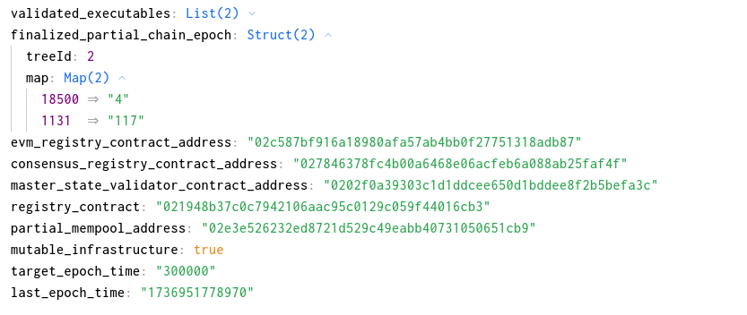
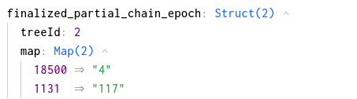
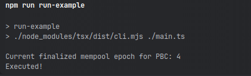

To run the example use the following command in a cli with working directory in this folder:
```shell
npm install
npm run run-example
```

For connecting and accessing Partisia Blockchain smart contract we will use the web3-commons library
from Unleashed Business github repositories.
To use it we have to require it as a dependency in our project by running the following command:
```shell
npm install @unleashed-business/ts-web3-commons --save
```
or by adding it manually to our package json as follows:
```json
{
  ...
  "dependencies": {
    "@unleashed-business/ts-web3-commons": "<version>",
    ...
  },
  ...
}
``` 

Once we have the dependency we can start by creating the PBC service for connecting and accessing smart contract
data. As in the example we have to create an instance of the class "PartisiaBlockchainService". In this
example we are only using the connection to read data from the chain and because of that we
can leave the argument for wallet connection as "undefined":
```typescript
import {PartisiaBlockchainService} from "@unleashed-business/ts-web3-commons/dist/pbc/pbc.service.js";
...

const partisiaConnection = new PartisiaBlockchainService(undefined);
```

Once we have an instance of our Partisia Blockchain connection service we can actually start
accessing the avl trees of the smart contracts using the "call" method. The method allows us to query
the state and avl trees of smart contracts on the Partisia Blockchain.
For this example we will be querying the Interchain Devnet Master Mempool, hosted on Partisia Testnet.
For this example the smart contract has the following state members: 

The state can be seen on the PBC Testnet explorer as well:
https://browser.testnet.partisiablockchain.com/contracts/02f9a29f8ecef8c727cddcb48efc486ce507b62851?tab=state
We will make a query to select to the avl tree with tree id #2 from the smart contract 
using the "call" method as follows: 
```typescript
import {PBCChain} from "@unleashed-business/ts-web3-commons/dist/pbc/pbc.chains.js";
import {ForkRegistryAbi} from "@crypto-factor-labs/interchain-ts-abi";

...

const finalizeEpochForPBC = await partisiaConnection.call(
    PBCChain.TESTNET,
    MasterChainMempoolAbi,
    "02f9a29f8ecef8c727cddcb48efc486ce507b62851",
    (state, trees) => { [1]
        const targetChain = 18500;

        const finalizeEpochTree = trees[2](U32TypeSpec, U64TypeSpec, false); [3]
        const chainEpoch = finalizeEpochTree.filter(x => x.key.asNumber() === targetChain).pop(); [4] 
        return chainEpoch.value.asBN().toString("hex"); [5]
    },
    [2] 
);
```
Alright, let us break down this code.
The first paramter is an object of type "ChainDefinition" which is a predefined object used
to describe the rpc connection parameters of a Partisia blockchain instance like testnet and mainnet.
That object has the following structure:
```typescript
{
  // id of the blockchain used by CFR infra to describe PBC: 
  // 18500 - PBC testnet
  // 8500 - PBC mainnet  
  id: number; 
  // name of the PBC chain instance 
  name: string;
  // list of rpc urls to use for connect to the blockchain
  // Example (official testnet rpc): https://node1.testnet.partisiablockchain.com 
  rpcList: string[];
  // List of shards for the chain instance
  // Shard0, Shard1, etc 
  shards: string[];
}
```
When we want to make a call we need to provide an object of this time to be used for 
the rpc calls. In the web3-commons library there is a set of predefined PBC chain definitions
for testnet and mainnet which can be used directly. In this example we use the predefined
testnet connection object "PBCChain.TESTNET".

Once we have provided the connection object we have to give the ABI definition of the target
smart contract as a second parameter. This is a special definition generated while compiling
the smart contract using PBC toolkit for rust. The abi here is expected as a BASE64 encoded string
of the ABI definition. For contract already deployed on the partisia network we can download the
ABI definition through the explorer. For example, we can find the abi for the Master Mempool of Interchain
dev net here:
https://browser.testnet.partisiablockchain.com/contracts/026a2ed097009a83301d88eef1305b69c5cb89bdf2
For this example we will use the publicly available ABI definition package for Interchain.
We can add that to our project using the following command:
```shell
npm install @crypto-factor-labs/interchain-ts-abi --save
```
or by adding it manually to our package json as follows:
```json
{
  ...
  "dependencies": {
    "@crypto-factor-labs/interchain-ts-abi": "<version>",
    ...
  },
  ...
}
``` 
Once we have the ABI package we can see that there we have a definition for the master mempool
which we can use for our call here as shown in [2].
If we open up the ABI definition variable we can see it looks like this:
```typescript
export const MasterChainMempoolAbi = "UEJDQUJJCgIABQYAAAAAHgEAAAAWSW50ZXJjaGFpbk1lbXBvb2xTdGF0ZQAAABQAAAAIY2hhaW5faWQDAAAADW93bmFibGVfc3RhdGUAAQAAABdvcmFjbGVfZXhlY3V0YWJsZV9zdGF0ZQACAAAAFGFjY2Vzc19jb250cm9sX3N0YXRlGRMODQAAAAVzdGF0ZQADAAAAFnBhcnRpYWxfY2hhaW5fbWVtcG9vbHMPAwAMAAAAHHBhcnRpYWxfY2hhaW5fbWVtcG9vbF9jaGFpbnMOAwAAAAt0eG5fbWVtcG9vbBkTABkAAAAQdHhuX21lbXBvb2xfbGlzdA4TAAAAGHZhbGlkYXRpb25fc3RlcF9wcm9ncmVzcw4DAAAAFXZhbGlkYXRlZF9leGVjdXRhYmxlcw4AFgAAAB1maW5hbGl6ZWRfcGFydGlhbF9jaGFpbl9lcG9jaBkDBAAAAB1ldm1fcmVnaXN0cnlfY29udHJhY3RfYWRkcmVzcw0AAAAjY29uc2Vuc3VzX3JlZ2lzdHJ5X2NvbnRyYWN0X2FkZHJlc3MNAAAAJ21hc3Rlcl9zdGF0ZV92YWxpZGF0b3JfY29udHJhY3RfYWRkcmVzcw0AAAARcmVnaXN0cnlfY29udHJhY3QNAAAAF3BhcnRpYWxfbWVtcG9vbF9hZGRyZXNzDQAAABZtdXRhYmxlX2luZnJhc3RydWN0dXJlDAAAABF0YXJnZXRfZXBvY2hfdGltZQQAAAAPbGFzdF9lcG9jaF90aW1lBAEAAAAMT3duYWJsZVN0YXRlAAAAAQAAAAVvd25lcg0BAAAAFU9yYWNsZUV4ZWN1dGFibGVTdGF0ZQAAAAcAAAAIY2hhaW5faWQDAAAAFWNvbnNlbnN1c19taW5fb3JhY2xlcwMAAAAfY29uc2Vuc3VzX21pbl9zaWduYXR1cmVfcGVyY2VudAMAAAAnY29uc2Vuc3VzX21heF9vcmFjbGVfc2lnbmF0dXJlX2xpZmV0aW1lBAAAAAttaW5fb3JhY2xlcwMAAAAVbWluX3NpZ25hdHVyZV9wZXJjZW50AwAAAB1tYXhfb3JhY2xlX3NpZ25hdHVyZV9saWZldGltZQQCAAAADE1lbXBvb2xTdGF0ZQAAAAgAAAQBAAUCAAYDAAcEAAgFAAkGAAoHAAsBAAAACFByb3Bvc2VkAAAAAAEAAAAVU291cmNlQmxvY2tWYWxpZGF0aW5nAAAAAAEAAAAWUGVuZGluZ1N0YXRlVmFsaWRhdGlvbgAAAAABAAAAD1N0YXRlVmFsaWRhdGluZwAAAAABAAAAB1NpZ25pbmcAAAAAAQAAAAlDb21taXR0ZWQAAAAAAQAAAAdEcm9wcGVkAAAAAAEAAAAHU2tpcHBlZAAAAAABAAAAFlBiY1BhcnRpYWxDaGFpbk1lbXBvb2wAAAACAAAABXN0YXRlAA0AAAAIc25hcHNob3QAEgIAAAAYUGFydGlhbENoYWluTWVtcG9vbFN0YXRlAAAABAAADgEADwIAEAMAEQEAAAAIUHJvcG9zZWQAAAAAAQAAAAxFVk1WYWxpZGF0ZWQAAAAAAQAAABJDb25zZW5zdXNWYWxpZGF0ZWQAAAAAAQAAAA5TdGF0ZVZhbGlkYXRlZAAAAAABAAAAHlBiY1BhcnRpYWxDaGFpbk1lbXBvb2xTbmFwc2hvdAAAAA0AAAAIY2hhaW5faWQDAAAABWVwb2NoBAAAAAh0eG5fbGlzdA4AEwAAAAxzb3VyY2VfYmxvY2sAFQAAAApzb3VyY2VfdHhuABUAAAAVc291cmNlX2V2bV9ibG9ja190eXBlCwAAABBzb3VyY2VfZXZtX3Byb29mDgEAAAAcc291cmNlX2V2bV9wcm9jZXNzX2V4ZWNfY29zdAQAAAAdc291cmNlX2V2bV92YWxpZGF0ZV9leGVjX2Nvc3QEAAAAFnNvdXJjZV9jb25zZW5zdXNfcHJvb2YOAQAAACJzb3VyY2VfY29uc2Vuc3VzX3Byb2Nlc3NfZXhlY19jb3N0BAAAABpzb3VyY2VfY29uc2Vuc3VzX2V4ZWNfY29zdAQAAAAacHJvY2Vzc190eG5fcm9vdF9leGVjX2Nvc3QEAQAAABhQYmNJbnRlcmNoYWluVHJhbnNhY3Rpb24AAAAGAAAABW5vbmNlABQAAAAIdHhuX2hhc2gAFQAAAA9leGVjdXRpb25fcGFydHMOABYAAAAGcmV2ZXJ0EgAWAAAABnNlbmRlcgAXAAAAGG9wZXJhdG9yX3N0YXRlX3ZhbGlkYXRvcgAXAQAAABFQYmNVaW50MjU2V3JhcHBlcgAAAAEAAAAFaW5uZXIYAQAAAA5QYmNIYXNoV3JhcHBlcgAAAAEAAAAFaW5uZXITAQAAACFQYmNJbnRlcmNoYWluTWVtcG9vbEV4ZWN1dGlvblBhcnQAAAAEAAAACGNoYWluX2lkAwAAAA5zZW5kZXJfYWRkcmVzcwAXAAAAEG9wZXJhdG9yX2FkZHJlc3MAFwAAABNleGVjdXRpb25fc2lnbmF0dXJlABgBAAAAEVBiY0FkZHJlc3NXcmFwcGVyAAAAAQAAAAVpbm5lcg0BAAAAD1BiY0J5dGVzV3JhcHBlcgAAAAEAAAAFaW5uZXIOAQEAAAASTWVtcG9vbFRyYW5zYWN0aW9uAAAAAgAAAAN0eG4AEwAAAA9vcmlnaW5fY2hhaW5faWQDAQAAAA1CbG9ja0hhc2hEYXRhAAAAAQAAAApibG9ja19oYXNoABUBAAAAJENoYWluVmFsaWRhdGlvbkV4ZWN1dGlvbkNhbGxiYWNrRGF0YQAAAAEAAAAGY2hhaW5zDgMBAAAAG1N0YXRlVmFsaWRhdGlvbkNhbGxiYWNrRGF0YQAAAAIAAAAWcHJvcG9zZV9ibG9ja19nYXNfY29zdAQAAAAOcHJveHlfZ2FzX2Nvc3QEAQAAABpFbXB0eUV4ZWN1dGlvbkNhbGxiYWNrRGF0YQAAAAAAAAAWAQAAAAppbml0aWFsaXpl/////w8AAAAJAAAAGGluaXRpYWxfcmVnaXN0cnlfYWRkcmVzcw0AAAAiaW5pdGlhbF9jb25zZW5zdXNfcmVnaXN0cnlfYWRkcmVzcw0AAAAvaW5pdGlhbF9tYXN0ZXJfc3RhdGVfdmFsaWRhdG9yX2NvbnRyYWN0X2FkZHJlc3MNAAAAGWluaXRpYWxfcmVnc2l0cnlfY29udHJhY3QNAAAAH2luaXRpYWxfcGFydGlhbF9tZW1wb29sX2FkZHJlc3MNAAAAD2luaXRpYWxfb3JhY2xlcw4NAAAACmlzX3Rlc3RuZXQMAAAAEndpdGhfbXV0YWJsZV9pbmZyYQwAAAARdGFyZ2V0X2Vwb2NoX3RpbWUEAgAAAAdwcm9wb3NlAQAAAAMAAAAJc25hcHNob3RzDgASAAAACnRpbWVzdGFtcHMOBAAAAApzaWduYXR1cmVzDgAYAgAAABhibG9ja19jb21taXR0ZWRfY2FsbGJhY2tJAAAAAQAAAAdfcmVzdWx0ABoCAAAAFmJsb2NrX2Ryb3BwZWRfY2FsbGJhY2tRAAAAAQAAAAdfcmVzdWx0ABoCAAAAEnRyYW5zZmVyX293bmVyc2hpcILOr8oDAAAAAQAAAAluZXdfb3duZXINAgAAABtzZXRfcGFydGlhbF9tZW1wb29sX2FkZHJlc3OKlJ3fAgAAAAEAAAALbmV3X2FkZHJlc3MNAgAAABVzZXRfdGFyZ2V0X2Vwb2NoX3RpbWWUndC1DAAAAAEAAAAEdGltZQQCAAAAFXRvZ2dsZV9vcmFjbGVfYWRkcmVzc5r74okFAAAAAgAAAAdhZGRyZXNzDQAAAA5leHBlY3RlZF92YWx1ZQwCAAAAGnNldF9tYXN0ZXJfc3RhdGVfdmFsaWRhdG9yn/mK2QYAAAABAAAAC25ld19hZGRyZXNzDQIAAAAYc2V0X2V2bV9yZWdpc3RyeV9hZGRyZXNzp/friQcAAAABAAAAC25ld19hZGRyZXNzDQIAAAAgc2V0X21pbl9vcmFjbGVfc2lnbmF0dXJlX3BlcmNlbnStvIyHDgAAAAEAAAAHcGVyY2VudAMCAAAAFHNldF9yZWdpc3RyeV9hZGRyZXNzt7L1wwEAAAABAAAAC25ld19hZGRyZXNzDQIAAAAec2V0X2NvbnNlbnN1c19yZWdpc3RyeV9hZGRyZXNzu+2b/A0AAAABAAAAC25ld19hZGRyZXNzDQIAAAAScmVub3VuY2Vfb3duZXJzaGlwxaKDVgAAAAACAAAADXJlbm91bmNlX3JvbGXFv93DDwAAAAIAAAAEcm9sZRMAAAATY2FsbGVyX2NvbmZpcm1hdGlvbg0CAAAAGHRyaWdnZXJfc3RhdGVfdmFsaWRhdGlvbsfTh8kOAAAABwAAABBwcm9jZXNzX2dhc19jb3N0BAAAAAlvcGVyYXRvcnMOABcAAAASb3BlcmF0b3JfZ2FzX2Nvc3RzDgQAAAAOcHJveHlfZ2FzX2Nvc3QEAAAAFnByb3Bvc2VfYmxvY2tfZ2FzX2Nvc3QEAAAACnRpbWVzdGFtcHMOBAAAAApzaWduYXR1cmVzDgAYAgAAAA9zZXRfbWluX29yYWNsZXPZgZbACwAAAAEAAAALbWluX29yYWNsZXMDAgAAACFzZXRfb3JhY2xlX21heF9zaWduYXR1cmVfbGlmZXRpbWXdlrqGDwAAAAEAAAAIbGlmZXRpbWUEAwAAACNldm1fdHhuX3ZhbGlkYXRlX2V4ZWN1dGlvbl9jYWxsYmFjayEAAAABAAAADmV4ZWN1dGlvbl9kYXRhABsDAAAAKmNvbnNlbnVzX2Jsb2NrX3ZhbGlkYXRlX2V4ZWN1dGlvbl9jYWxsYmFjayMAAAABAAAADmV4ZWN1dGlvbl9kYXRhABsDAAAAI3N0YXRlX3ZhbGlkYXRpb25fZXhlY3V0aW9uX2NhbGxiYWNrJAAAAAEAAAAEZGF0YQAcAwAAACBibG9ja19wcm9wb3NlX2V4ZWN1dGlvbl9jYWxsYmFjaykAAAABAAAAD19leGVjdXRpb25fZGF0YQAdAAA=";
```
Which is just a variable holding the content of the ABI downloaded from the explorer as shown earlier.

Once we define the connection and the target abi we have to provide the target smart contract address
to our call method. The smart contract address is obtained when we deploy the smart contract to the 
partisia blockchain, and usually it remains the same long-term unless there is an update requiring 
a change of the address. The addresses can also be seen from the partisia explorer, and
we will be using the Interchain devnet Master Mempool in this example. \
The address which we will be using is: 02f9a29f8ecef8c727cddcb48efc486ce507b62851,
which can also be found in the PBC testnet explorer: \
https://browser.testnet.partisiablockchain.com/contracts/02f9a29f8ecef8c727cddcb48efc486ce507b62851 

The last parameter we need to provide is a callback which aims to deserialize the state or/and avl trees 
for our particular need.
To query avl trees we have to provide some extra parameters on top of the ones used for
querying only the state.
On top of the state input we are using the second parameter "trees", which gives us a map of builders for the avl trees
where the keys of the map are tree ids. [1] \
The map with trees only contains the trees with ids provided in the optional second parameter of the call function which
is an array of numbers ([2]).
We can find the treeId of an avl tree from the explorer, and for our example this is the number 2:

Once we have our tree added to the "trees" builder map we can execute the builder, for which we need to provide
three arguments: a type spec for the key, a type spec for the value, a boolean to tell the builder if the value spec
is a custom struct. For our example the key of the finalize partial chain epochs is a u32 number and the value is a u64 number.
Because we are using simple type we are providing false as the final parameter for the builder. [3]
An example for a tree with custom struct type is also available as a stand-alone example. \
Once we call the builder we have access to a list of deserializable key-value pairs of the avl map structure.
In this lightweight example there is no problem in having the whole tree over which we can execute in-memory filters.
For larger trees (>1m values) we need to use the abl tree http client for partial deserialization.
To find the value in the tree for our chain, which in the example is 18500, we can run a normal filter over the array of
key-value pairs with a check for the key deserialized as a number. [4] 
The type of that value is an address. Addresses on PBC are one of the special types, which we need to deserialize
using a predefined method, in this case "addressValue" [5], which will return us the address as a 
Buffer of bytes. To make it more "useable" for the example we encode the buffer as a "hex" string. \
After we finish deserialization we can return the values of interest as a result for the callback which
as also returns it as a result to the "call" function. \
Once we have the values we print em in the console:
