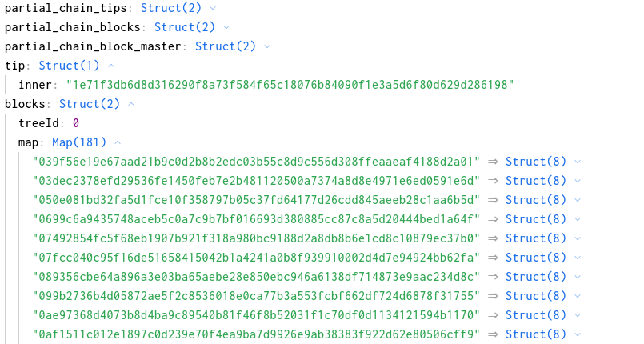
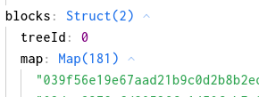
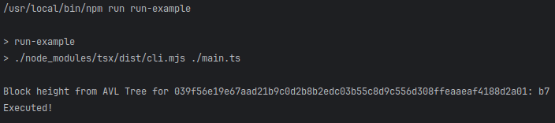

To run the example use the following command in a cli with working directory in this folder:
```shell
npm install
npm run run-example
```

For connecting and accessing Partisia Blockchain smart contract we will use the web3-commons library
from Unleashed Business github repositories.
To use it we have to require it as a dependency in our project by running the following command:
```shell
npm install @unleashed-business/ts-web3-commons --save
```
or by adding it manually to our package json as follows:
```json
{
  ...
  "dependencies": {
    "@unleashed-business/ts-web3-commons": "<version>",
    ...
  },
  ...
}
``` 

Once we have the dependency we can start by creating the PBC service for connecting and accessing smart contract
data. As in the example we have to create an instance of the class "PartisiaBlockchainService". In this
example we are only using the connection to read data from the chain and because of that we
can leave the argument for wallet connection as "undefined":
```typescript
import {PartisiaBlockchainService} from "@unleashed-business/ts-web3-commons/dist/pbc/pbc.service.js";
...

const partisiaConnection = new PartisiaBlockchainService(undefined);
```

Once we have an instance of our Partisia Blockchain connection service we can actually start
accessing larger avl trees of the smart contracts using the "fetchAVLTreeValueByKey" method. 
For this example we will be querying the Interchain Partisia fork Masterchain, hosted on Partisia Testnet.
For this example the smart contract has the following state members: 

The state can be seen on the PBC Testnet explorer as well:
https://browser.testnet.partisiablockchain.com/contracts/026a2ed097009a83301d88eef1305b69c5cb89bdf2?tab=state
We will make a query to select from the avl tree with tree id #0 and key "039f56e19e67aad21b9c0d2b8b2edc03b55c8d9c556d308ffeaaeaf4188d2a01"
from the smart contract using the "fetchAVLTreeValueByKey" method as follows: 
```typescript
import {PBCChain} from "@unleashed-business/ts-web3-commons/dist/pbc/pbc.chains.js";
import {MasterChainAbi} from "@crypto-factor-labs/interchain-ts-abi";
import {StructTypeSpec} from "@partisiablockchain/abi-client/target/main/types/StructTypeSpec.js";
...

const targetBlockHash = "039f56e19e67aad21b9c0d2b8b2edc03b55c8d9c556d308ffeaaeaf4188d2a01";
const blockHeight = await partisiaConnection.fetchAVLTreeValueByKey<string>(
    PBCChain.TESTNET,
    MasterChainAbi,
    "026a2ed097009a83301d88eef1305b69c5cb89bdf2",
    0, [1]
    Buffer.from(targetBlockHash, "hex"), [2]
    (value, namedTypes) => { [3]
        const targetBlock = value.readStruct(namedTypes["PbcMasterChainBlock"] as StructTypeSpec); [4]
        return targetBlock.getFieldValue("height")!.asBN().toString("hex"); [5]
    }
);
```
Alright, let us break down this code.
The first paramter is an object of type "ChainDefinition" which is a predefined object used
to describe the rpc connection parameters of a Partisia blockchain instance like testnet and mainnet.
That object has the following structure:
```typescript
{
  // id of the blockchain used by CFR infra to describe PBC: 
  // 18500 - PBC testnet
  // 8500 - PBC mainnet  
  id: number; 
  // name of the PBC chain instance 
  name: string;
  // list of rpc urls to use for connect to the blockchain
  // Example (official testnet rpc): https://node1.testnet.partisiablockchain.com 
  rpcList: string[];
  // List of shards for the chain instance
  // Shard0, Shard1, etc 
  shards: string[];
}
```
When we want to make a call we need to provide an object of this time to be used for 
the rpc calls. In the web3-commons library there is a set of predefined PBC chain definitions
for testnet and mainnet which can be used directly. In this example we use the predefined
testnet connection object "PBCChain.TESTNET".

Once we have provided the connection object we have to give the ABI definition of the target
smart contract as a second parameter. This is a special definition generated while compiling
the smart contract using PBC toolkit for rust. The abi here is expected as a BASE64 encoded string
of the ABI definition. For contract already deployed on the partisia network we can download the
ABI definition through the explorer. For example, we can find the abi for the Partisia fork Masterchain of Interchain here:
https://browser.testnet.partisiablockchain.com/contracts/026a2ed097009a83301d88eef1305b69c5cb89bdf2
For this example we will use the publicly available ABI definition package for Interchain.
We can add that to our project using the following command:
```shell
npm install @crypto-factor-labs/interchain-ts-abi --save
```
or by adding it manually to our package json as follows:
```json
{
  ...
  "dependencies": {
    "@crypto-factor-labs/interchain-ts-abi": "<version>",
    ...
  },
  ...
}
``` 
Once we have the ABI package we can see that there we have a definition for the masterchain.
If we open up the ABI definition variable we can see it looks like this:
```typescript
export const MasterChainAbi = "UEJDQUJJCgIABQYAAAAAEgEAAAAaSW50ZXJjaGFpbk1hc3RlckNoYWluU3RhdGUAAAARAAAADW93bmFibGVfc3RhdGUAAQAAABByZWdpc3RyeV9hZGRyZXNzDQAAABRibG9ja19zaWduZXJfYWRkcmVzcw0AAAANYmxvY2tfc2lnbmVycw4NAAAAH2Jsb2NrX3NpZ25lcnNfY291bnRfcmVxdWlyZW1lbnQDAAAAFmVuYWJsZWRfcGFydGlhbF9jaGFpbnMQAwAAABJwYXJ0aWFsX2NoYWluX3RpcHMZAxMAAAAUcGFydGlhbF9jaGFpbl9ibG9ja3MZEwACAAAAGnBhcnRpYWxfY2hhaW5fYmxvY2tfbWFzdGVyGRMTAAAAA3RpcAADAAAABmJsb2NrcxkTAAcAAAAQY29uZmlybWF0aW9uX3RpcAADAAAAEWNvbmZpcm1hdGlvbl90aW1lBAAAAA5wcm9wb3NlZF9ibG9jaxIABwAAABdwcm9wb3NlZF9wYXJ0aWFsX2Jsb2Nrcw8DAAIAAAAZZm9ya2VkX3VuY29uZmlybWVkX2Jsb2Nrcw4ACQAAABZtdXRhYmxlX2luZnJhc3RydWN0dXJlDAEAAAAMT3duYWJsZVN0YXRlAAAAAQAAAAVvd25lcg0BAAAAFFBiY1BhcnRpYWxDaGFpbkJsb2NrAAAABwAAAAhjaGFpbl9pZAMAAAAGaGVpZ2h0BQAAAA9wcmV2X2Jsb2NrX2hhc2gAAwAAABRleGVjdXRpb25fcGFydHNfcm9vdAADAAAACmJsb2NrX2hhc2gAAwAAAAljb25maXJtZWQMAAAAD2V4ZWN1dGlvbl9wYXJ0cw4ABAEAAAAOUGJjSGFzaFdyYXBwZXIAAAABAAAABWlubmVyEwEAAAAPUGJjRWVjdXRpb25QYXJ0AAAAAwAAABBvcGVyYXRvcl9hZGRyZXNzAAUAAAAOc2VuZGVyX2FkZHJlc3MABQAAABNleGVjdXRpb25fc2lnbmF0dXJlAAYBAAAAEVBiY0FkZHJlc3NXcmFwcGVyAAAAAQAAAAVpbm5lcg0BAAAAD1BiY0J5dGVzV3JhcHBlcgAAAAEAAAAFaW5uZXIOAQEAAAATUGJjTWFzdGVyQ2hhaW5CbG9jawAAAAgAAAAGaGVpZ2h0BQAAAAl0aW1lc3RhbXAEAAAAD3ByZXZfYmxvY2tfaGFzaAADAAAAE3BhcnRpYWxfYmxvY2tzX3Jvb3QAAwAAAApibG9ja19oYXNoAAMAAAAKc2lnbmF0dXJlcw4ABgAAAA5wYXJ0aWFsX2Jsb2Nrcw4ACAAAAA1jb25maXJtYXRpb25zDgADAQAAACFQYmNNYXN0ZXJDaGFpbkJsb2NrUGFydGlhbENvbnRlbnQAAAACAAAACmJsb2NrX2hhc2gAAwAAAAhjaGFpbl9pZAMBAAAAFlVuY29uZmlybWVkRm9ya2VkQmxvY2sAAAACAAAACmJsb2NrX2hhc2gAAwAAAAl0aW1lc3RhbXAEAQAAABFQcm9wb3NlZEJsb2NrQm9keQAAAAIAAAAOcGFydGlhbF9jaGFpbnMOAwAAABV2YWxpZGF0ZWRfZXhlY3V0YWJsZXMOAAsBAAAAIVBiY0ludGVyY2hhaW5NZW1wb29sRXhlY3V0aW9uUGFydAAAAAQAAAAIY2hhaW5faWQDAAAADnNlbmRlcl9hZGRyZXNzAAUAAAAQb3BlcmF0b3JfYWRkcmVzcwAFAAAAE2V4ZWN1dGlvbl9zaWduYXR1cmUABgEAAAAaRW1wdHlFeGVjdXRpb25DYWxsYmFja0RhdGEAAAAAAQAAAA9Gb3JrSW5mb3JtYXRpb24AAAAEAAAABmhlaWdodAUAAAADdGlwAAMAAAAZcGFydGlhbF9ibG9ja19pbmZvcm1hdGlvbg4ADgAAABJ1bmNvbmZpcm1lZF9ibG9ja3MOAA8BAAAAG1BhcnRpYWxDaGFpbkZvcmtJbmZvcm1hdGlvbgAAAAMAAAAIY2hhaW5fdWQDAAAABmhlaWdodAUAAAADdGlwAAMBAAAAEFVuY29uZmlybWVkQmxvY2sAAAACAAAACmJsb2NrX2hhc2gAAwAAAAl0aW1lc3RhbXAEAQAAAA1CbG9ja0hhc2hEYXRhAAAAAQAAAApibG9ja19oYXNoAAMBAAAAD1NpZ25lZEJsb2NrRGF0YQAAAAIAAAAKYmxvY2tfaGFzaBMAAAAQYmxvY2tfc2lnbmF0dXJlcw4VAAAADAEAAAAKaW5pdGlhbGl6Zf////8PAAAABQAAABxpbml0aWFsX2Jsb2NrX3NpZ25lcl9hZGRyZXNzDQAAABVpbml0aWFsX2Jsb2NrX3NpZ25lcnMODQAAABByZWdpc3RyeV9hZGRyZXNzEg0AAAAZaW5pdGlhbF9jb25maXJtYXRpb25fdGltZQQAAAAQaXNfbXV0YWJsZV9pbmZyYQwCAAAADXByZXBhcmVfYmxvY2sBAAAAAQAAAAhwcm9wb3NhbAAKAgAAABNmZXRjaF9wZW5kaW5nX2Jsb2NrAgAAAAEAAAAFX2RhdGEADAIAAAAWZmV0Y2hfZm9ya19pbmZvcm1hdGlvbgMAAAABAAAABV9kYXRhAAwCAAAAD2luaXRpYWxpemVfZm9yawQAAAABAAAABGRhdGEADQIAAAAeZmV0Y2hfYmxvY2tfY29uZmlybWF0aW9uX3N0YXRlBQAAAAEAAAAEZGF0YQAQAgAAABFwdXNoX3NpZ25lZF9ibG9jawYAAAADAAAACnNpZ25hdHVyZXMAEQAAABltZW1wb29sX2NhbGxiYWNrX2dhc19jb3N0BAAAAA5wcm94eV9nYXNfY29zdAQCAAAAEnRyYW5zZmVyX293bmVyc2hpcILOr8oDAAAAAQAAAAluZXdfb3duZXINAgAAABRzZXRfcmVnaXN0cnlfYWRkcmVzc7ey9cMBAAAAAQAAABByZWdpc3RyeV9hZGRyZXNzDQIAAAAWc2V0X2NvbmZpcm1hdGlvbl90aW1lc8CUkNAFAAAAAQAAABFjb25maXJtYXRpb25fdGltZQQCAAAAEnJlbm91bmNlX293bmVyc2hpcMWig1YAAAAAAgAAABBzZXRfYmxvY2tfc2lnbmVy6b+ooQEAAAACAAAAFGJsb2NrX3NpZ25lcl9hZGRyZXNzDQAAAA1ibG9ja19zaWduZXJzDg0AAA==";
```
Which is just a variable holding the content of the ABI downloaded from the explorer as shown earlier.

Once we define the connection and the target abi we have to provide the target smart contract address
to our call method. The smart contract address is obtained when we deploy the smart contract to the 
partisia blockchain, and usually it remains the same long-term unless there is an update requiring 
a change of the address. The addresses can also be seen from the partisia explorer, and
we will be using the Partisia fork masterchain of Interchain in this example. \
The address which we will be using is: 026a2ed097009a83301d88eef1305b69c5cb89bdf2,
which can also be found in the PBC testnet explorer: \
https://browser.testnet.partisiablockchain.com/contracts/026a2ed097009a83301d88eef1305b69c5cb89bdf2 

The next parameter we have to provide is the tree id of the target avl tree of our query.
We can find the treeId of an avl tree from the explorer, and for our example this is the number 0 [1]:
 \

After the tree id we need to provide the key of the target value for our query in a bytes buffer. For our example
we want to provide the block hash in a buffer which we can do with "Buffer.from()" like shown in: [2]. \

The final parameter we need to provide is a callback which aims to deserialize the value of the avl tree 
for our particular need. [3]
The type spec for the value we are selection is a custom struct, and we get can get it form the namedTypes parameter 
with the name of our struct - "PbcMasterChainBlock".
With the spec of our struct we can deserialize it from the reader with "readStruct()" method where we provide the
spec of the expected value. [4]
Structs on PBC are one of the special types which will return us the deserialiable struct with access to
all the fields like we would deserialize any other state variable. From there we can make a query for the "height" field 
of the struct which we can deserialize as a bignumber and encode as hex for readability. \
Once we have the values we print em in the console:
